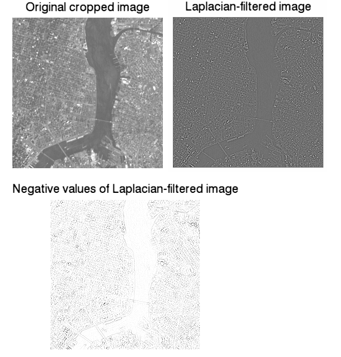

## camerad Module Overview

### camerad Testing
 * Specifically looking at the comma3 camera unit tests which have 3 cameras.
  * Test_camerad.py - The camerad unit test sets up the messaging sockets for the 3 cameras.
    * It clears the logs then collects them by frame for each camera.
    * After clearing the beginning and end frames to account for camera startup time, it tests that each camera has logs for each frame taken. If any      frames are skipped by any camera, the test fails. 
    * After the test, the process manager shuts down the camera module.
    * In addition, it checks the difference of times between each frame. If any frame has more than a 0.5 ms delay, they are considered too laggy to be used and the test fails
  * Check_skips.py:
    * In addition, there is a file that specifically checks the messaging relation for the cameras that will print out which camera message socket has skips and how many are skipped for troubleshooting purposes.
  * Frame_test.py and Test_exposure.py
    * Frame test checks validates imaging libraries and camera message publishing system are working properly.
    * Test_exposure actually uses the snapshots from the camerad module. It then checks that the cameras are focusing properly by making the images grayscale and checking the exposure for each picture from each camera. Has built-in thresholds to check the images against. Must pass all camera checks in a row for each frame

### imgproc
* Two .cl files, representing computing language files which are used for accelerating speed and responsiveness of applications such as vision processing and neural network training.
* mainly focus on conv.cl - takes an RGB image and performs convolution between the kernel and the image
    * in image processing, a kernel is a small matrix used for blurring, sharpening, and edge detection
    * convolution is a mathematical operation which involves two functions (such as f and g) and produces a third function (f \* g)
    * However, in image processing terms, convolution refers to the process of adding each element of an image to its local neighbors, weighted by the kernel. This relates to the form of the matrix operation used in mathematical convolution
    * When convolution is applied, the original image(denoted as f(x,y)) undergoes a specific operation involving the filter kernel(denoted as the omega function, w) that can produce a wide range of effects, producing a filtered image(denoted as g(x,y))
    * Therefore, the conv.cl file in openPilot functions by caching local pixels of an image, comparing the size to that of the filter size, and finally performing convolution operations
    * This results in a resulting image which would be a weighted sum or combination of all the entries of the image matrix, with weights given by the kernel
* pool.cl - calculates the variance in each subregion of an image
* utils.cc - contains utility helper functions that help perform more complex mathematical operation
    * LapConv which is assumed to be a helper function to perform Laplace Transform Convolution
    * Laplacian filters are used to detect edges in images. As a spacial filter, it helps to reduce spatial noise and enhance prediction in image processing
    * As an edge detector, laplacian filters are used to compute second derivatives on an image, measuring the rate at which first derivatives change.
     This determines if a change in adjacent pixel values originate from an edge or continuous progression.
     